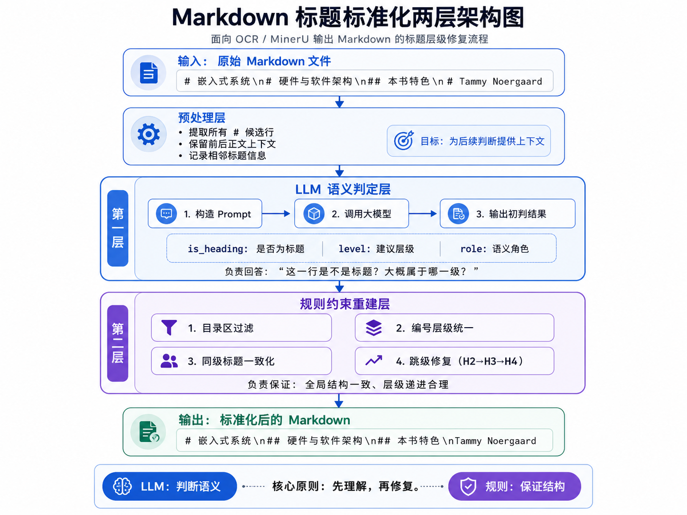

<h1 align="center">Markdown 标题标准化工具</h1>

<p align="center">
  
  
  
</p>

<p align="center">
  <b>面向 OCR / MinerU 输出 Markdown 的标题层级修复与文档结构重建工具。</b>
</p>

---

## ✨ 项目简介

很多 OCR 或 MinerU 转换得到的 Markdown 文件，虽然已经提取出了文本内容，但标题结构经常不可靠，常常出现一下情况：

- 正文、作者名、页眉页脚被误识别成 `#` 标题；
- `#`、`##`、`###` 层级混乱；
- 目录条目和正文标题混在一起；
- 章节编号虽然存在，但 Markdown 层级没有对应好。

因此，本项目的目标是：

> **采用本地部署模型进行批量转换（也可接入其他云端模型），实验发现 30B 的 Qwen3 已能很好地满足需求——将 OCR / MinerU 输出的 Markdown 整理成标题层级清晰、适合后续 RAG / GraphRAG / 语料库建设的结构化 Markdown。**

项目核心脚本为：

```text
tools.py
```

典型输入：

```markdown
# 嵌入式系统
# 硬件与软件架构
## 本书特色
# Tammy Noergaard
# 内容提要
```

典型输出：

```markdown
# 嵌入式系统
## 硬件与软件架构
## 本书特色
Tammy Noergaard
## 内容提要
```

---

## 📌 使用范围

| 文档类型            | 推荐程度 | 说明                               |
| ------------------- | :-------: | ---------------------------------- |
| 期刊论文、会议论文  |  ✅ 推荐  | 篇幅较短，标题模式稳定             |
| 硕士 / 博士学位论文 |  ✅ 推荐  | 章节编号和目录结构通常比较清晰     |
| 技术报告、课程讲义  | ⚠️ 可用 | 需要检查标题模式是否一致           |
| 500 页以上长书      | ⚠️ 谨慎 | 候选标题多，容易出现跨批次层级漂移 |

> **注：** 目前主要采用本地部署的 **Qwen3-30B** 模型，在上述使用情景中表现良好，能够较好地兼顾语义理解准确性与推理速度。

---

## 🚀 简单使用方式

### 1. 根据 `requirements.txt` 配置环境

`requirements.txt` 中说明：核心脚本 `tools.py` 不依赖第三方库，主要使用 Python 标准库；项目要求 Python ≥ 3.8；`ipykernel` 主要用于 `test_stepbystep.ipynb` 调试(tools.py的测试文件)。

#### Windows PowerShell

```powershell
python -m venv .venv
.\.venv\Scripts\Activate.ps1
python -m pip install -U pip
pip install -r requirements.txt
```

#### Ubuntu / macOS

```bash
python3 -m venv .venv
source .venv/bin/activate
python -m pip install -U pip
pip install -r requirements.txt
```

#### 也可以使用 Conda：

```bash
conda create -n md-heading python=3.10
conda activate md-heading
pip install -r requirements.txt
```

---

### 2. 在 `tools.py` 中配置大模型 API

本工具会调用大模型判断标题语义，因此运行前需要先配置模型 API。

打开 `tools.py`，找到模型配置区域，根据自己的服务填写：

```python
API_KEY = "your_api_key_here"
BASE_URL = "http://192.168.3.131:8000/v1/chat/completions"
MODEL = "deepseek-v4"
```

如果你的代码使用环境变量，也可以对应配置：

```text
LLM_API_KEY / API_KEY
LLM_BASE_URL
LLM_MODEL
```

输入/输出 Token 配置（`tools.py` 顶部常量）：

```python
CONTEXT_LENGTH = 16384    # 模型上下文窗口
OUTPUT_TOKENS  = 2000     # 每次 LLM 调用的最大输出 token
TOKEN_BUDGET   = CONTEXT_LENGTH - OUTPUT_TOKENS - 700   # prompt 可用 token 预算
```

---

### 3. 在终端激活虚拟环境并执行转换

#### 处理单个文件

```powershell
# Windows PowerShell
.\.venv\Scripts\Activate.ps1
python tools.py example.md
```

```bash
# Ubuntu / macOS
source .venv/bin/activate
python tools.py example.md
```

#### 批量处理指定文件夹

将需要处理的 `.md` 文件放入同一个文件夹（例如 `inputs\`），直接传入文件夹路径即可：

```powershell
# Windows PowerShell
.\.venv\Scripts\Activate.ps1
python tools.py inputs\
```

```bash
# Ubuntu / macOS
source .venv/bin/activate
python tools.py inputs/
```

> `tools.py` 会自动递归查找文件夹下所有 `.md` 文件并逐一处理。

#### 自定义输出路径

`--out-dir` 和 `--json-dir` 是命令行参数，在执行时指定：

```bash
python tools.py inputs/ --out-dir my_output --json-dir my_json
```

| 参数            | 默认值               | 说明                            |
| --------------- | -------------------- | ------------------------------- |
| `--out-dir`   | `standardized_md2` | 标准化 Markdown 输出目录        |
| `--json-dir`  | `heading_json2`    | 标题判定结果 JSON 输出目录      |
| `--cache-dir` | （无）               | 启用 LLM 结果缓存，避免重复调用 |
| `--resume`    | —                   | 跳过已处理的文件，断点续跑      |

完整示例：

```bash
python tools.py inputs/ --out-dir outputs --json-dir json_results --cache-dir .cache --resume
```

---

## 🧠 第一性原理说明

Markdown 标题标准化的本质，不是简单地把 `#` 改成 `##`，而是对每一个候选标题重新回答两个问题：

| 问题                           | 输出变量       |
| ------------------------------ | -------------- |
| 这一行到底是不是正文标题？     | `is_heading` |
| 如果是标题，它应该属于哪一级？ | `level`      |

所以整个项目可以理解成一个“两层判断系统”：



### 为什么需要 LLM？

因为很多标题问题不是单靠正则表达式能判断的。例如：

```markdown
# Tammy Noergaard
```

它看起来像标题，但结合上下文可能只是作者名。
这类问题需要语义理解，所以交给 LLM 判断更合适。

LLM 主要负责：

- 判断作者名、版权页、页眉页脚是否误判为标题；
- 判断“摘要”“内容提要”“参考文献”等是否是正文结构；
- 根据上下文判断一个候选行在文档中的语义角色。

### 为什么还需要规则？

LLM 适合理解语义，但不擅长保证全局一致性。比如：

```text
1.1 被判断成 H3
1.2 被判断成 H2
1.3 被判断成 H3
```

从语义上看都像标题，但结构上必须统一。

所以第二层规则负责做结构修复：

- 目录区条目不作为正文标题；
- `1.1`、`1.2`、`1.3` 这类同级编号统一到同一层；
- 修复 `H2 → H4` 这种标题跳级；
- 保证整篇文档只有合理的层级递进。

核心原则是：

> **LLM 负责判断“是不是标题”，规则负责保证“层级是否一致”。**

最终输出的 Markdown 会尽量保留原文内容，只调整标题结构，为后续章节切分、RAG 检索、GraphRAG 建库和 Neo4j 章节节点建模提供更稳定的文档基础。
